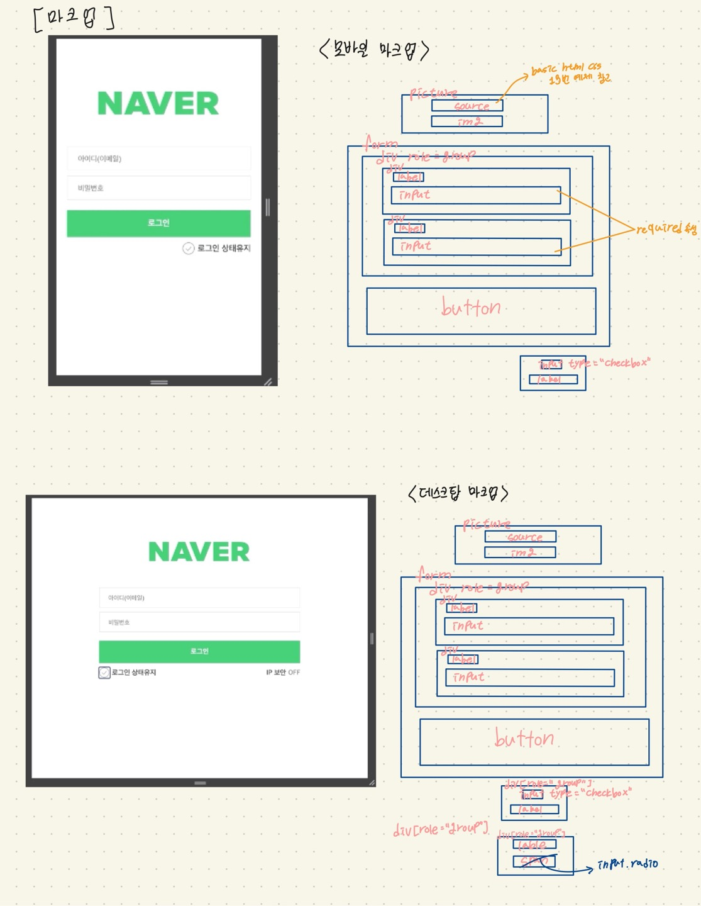
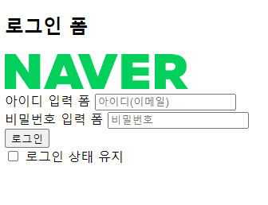
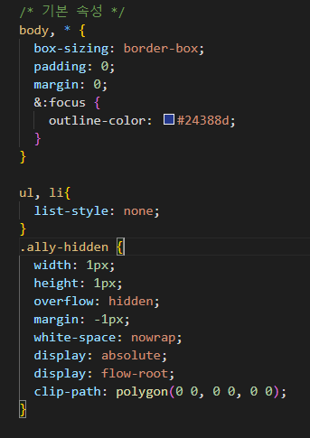

2번째 과제 네이버 로그인 페이지 마크업
===================================

1. 구조 마크업 그려보기

> 학습 때 배운 구조 기반으로 CSS를 제외한 노멀플로우 HTML 구조를 간단하게 그려보았습니다. (속성 값이나 CSS스타일링도 손코딩 해보려고 했으나 너무 시간이 많이 걸릴 것 같아서 일단 VSCODE로 구조 설계 시작.)

2. HTML 마크업

> 모바일 버전 마크업으로 처음엔 form영역 밑 구조를 div태그로 묶어서 작성하였으나 후에 데스크탑 구조를 추가하면서 ul요소로 묶어 리스트로 구현하였습니다. 

3. CSS스타일링 시작

> 기존에 배운 reset 코드를 보며 지금 필요한 reset스타일들을 확인하며 적용하여 어떤 목적을 위해 속성을 부여하는지 확인하였습니다.

- 어려웠던 점: 로고를 picture요소로 마크업 하였더니 margin으로 가운데 정렬이 안되었습니다. 우선 magin-left: 50%; 속성을 부여하여 왼쪽을 화면 가운데에 맞추고 고정 크기인 로고의 1/2px만큼 간격을 주어 가운데 정렬을 하였습니다. 

4. 스타일을 하며 클래스 명과 접근성 관련 속성들 작성
> 태그에 필수적으로 들어가는 속성 값 외에도 접근성을 높이기 위한 aria-label, aria-pressed 등의 접근성 속성들을 사용하였습니다. 

5. 데스크탑 관련 요소 추가 및 미디어 쿼리 추가
> 과제에 제시된 조건대로 768px이 넘는 뷰포트에선 로그인 폼이 500px로 고정되어 출력되게 작성하고 IP보안 토글 버튼을 생성하고 출력 구조를 다르게 출력하였습니다. 

- 탭키로 토글버튼에 포커스 디자인은 구현하였으나 시간 부족으로 키보드로 토글 버튼을 선택하는 기능은 구현하지 못하였습니다.😭

